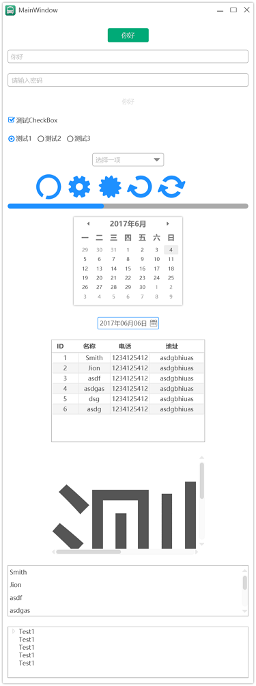

# YUI - (WPF Controls And Toolkit library)

This library contains `controls` `styles` and `toolkit`. 
More is being added...  

## Examples

## Develop Environment
`Visual Studio 2017` `.NET 4.5.2` 
